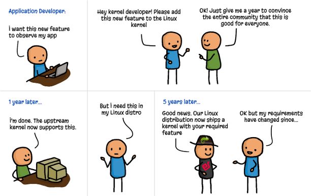
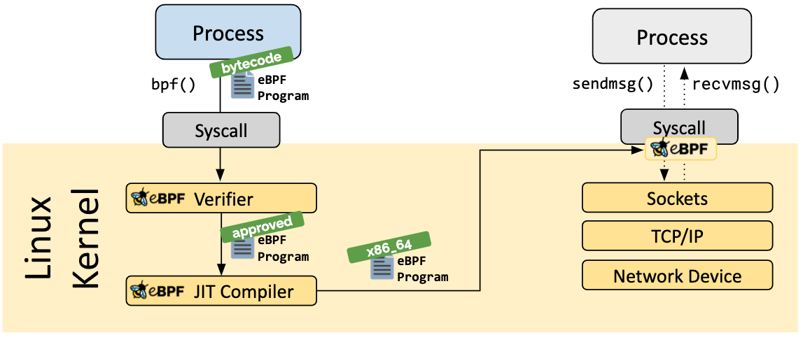

# eBPF 101

eBPF basics, use cases and how to get started

🐝🐝🐝

<!-- <div class="pt-12">
  <span @click="$slidev.nav.next" class="px-2 py-1 rounded cursor-pointer" hover="bg-white bg-opacity-10">
    start <carbon:arrow-right class="inline"/>
  </span>
</div> -->

<div class="abs-br m-6 flex gap-2">
  <a href="https://github.com/krishanthisera/ebpf-101" target="_blank" alt="GitHub" title="Open in GitHub"
    class="text-xl slidev-icon-btn opacity-50 !border-none !hover:text-white">
    <carbon-logo-github />
  </a>
</div>

<!--
The last comment block of each slide will be treated as slide notes. It will be visible and editable in Presenter Mode along with the slide. [Read more in the docs](https://sli.dev/guide/syntax.html#notes)
-->

---

# Introduction

- ePPF, stands for **extended Berkeley Packet Filter**
  - it roots back to the original BPF, which was introduced in whitepaper: [BSD Packet Filter](https://www.tcpdump.org/papers/bpf-usenix93.pdf)
  - term **BPF** and **eBPF** are often used interchangeably
- Key Use Cases:
  - **Networking:** widely used for advanced networking tasks such as load balancing, firewalling, and traffic control
  - **Observability:** tools like bpftrace and BCC leverage eBPF for deep system introspection and monitoring
  - **Security:** applications for intrusion detection and prevention, as well as for implementing security policies
- **Community and Ecosystem**: supported by a vibrant community and a growing number of tools and libraries, such as libbpf, which facilitate eBPF development and deployment

---

# Introduction | Kernel and User Space

Quick summary of the kernel and user space:


- **Kernel**:
  - the core of the operating system
    - kernel use drivers to interact with hardware
  - manage and control hardware
  - process and memory management
  - file system management
- **User Space**:
  - where the user applications run
    - user space application talks to the kernel using system calls

---

# Introduction | Example System Call

```bash
strace -c echo "hello"
```


---

# Introduction | Adding a feature to the Kernel



- Adding a feature to the upstream
  - requires kernel development skills
  - requires kernel recompilation
  - long process
    - create a MR and get it reviewed
    - wait for the MR to be added to upstream
    - wait for the next kernel release
    - wait for the specific distribution to include the new kernel

---

# Introduction | Adding a feature to the Kernel

- **Kernel modules**
  - change or extend kernel behavior without modifying the main kernel code
  - distribute independently of the official Linux kernel release
  - not need to be accepted into the main upstream maintainers


- **Writing a Kernel modules**
  - requires kernel development knowledge
  - safety and reliability of a kernel module is crucial
    - this why Linux distributions take time to incorporate new releases
  - if the module crashes, the whole system could be crashed, or stuck in a hard loop
  - security vulnerabilities could be introduced

---

# Introduction | eBPF

Why eBPF?


- can be dynamically loaded into and removed from the kernel
- can be attached to an event, they trigger regardless of what caused the event
- faster development cycle
- has visibility over processes, network, and file system
  - on both containers and the host machine

---

# Introduction | eBPF Attach Points

eBPF programs can be attached to various attach points in the kernel


- Networking:
  - **XDP**: attach to the network interface
  - **TC**: attach to the traffic control subsystem
- Tracing:
  - **kprobes**: tap into arbitrary kernel functions/code
  - **uprobes**: tap into user-space functions (user needs to link the function with uprobes)
  - **tracepoints**: attach to a predefined tracepoint (to list tracepoints `perf list tracepoint`)
  - **perf events**: attach to a performance event (eg: cache misses, cpu cycles)
- Security:
  - **LSM**: attach to a LSM hook (eg: `SEC("lsm/path_chmod")`)
  - **seccomp**: attach to system calls, which triggers seccomp filters

<!--
- trace points are more robust than kprobes since they are less likely to change between kernel versions
-->

---

# BPF Program anatomy

<div style="text-align: left; margin-top: 30px; margin-bottom: 40px;">

</div>



- eBPF programs are written in limited C
  - features like loops, variadic functions, function calls and etc., are omitted
- eBPF programs are compiled to **eBPF bytecode**
- eBPF bytecode is then compiled to machine code

---

# BPF Program anatomy


- **eBPF bytecode**
  - compiled from eBPF source code
- **Verifier**
  - analyzes the program to assess all possible execution paths
  - see if eBPF program wouldn't crach during the runtime
  - state pruning capabilities to reduce the number of states to be analyzed
- **JIT Compiler**
  - converts bytecode to native machine code to run on targeted machine
- **eBPF virtual machine**
  - like any other virtual machine, virtual implementation of a computer
  - compiled eBPF bytecode contains instructions

<!--
  llvm-objdump -S counter.bpf.o
  you can't call system calls directly from eBPF program
 -->

---

# eBPF Hello World

Hello world program using BCC framework

- eBPF program, which runs on the kernel

  ```c
  int hello() {

    u32 uid = bpf_get_current_uid_gid() & 0xFFFFFFFF; // Get current user ID

    bpf_trace_printk("Hello World! UID: %d", uid); // Print message to the kernel trace log
  return 0;
  ```

- User space code

  ```python
  #!/usr/bin/python3
  from bcc import BPF

  program = """Above pseudo c code"""

  b = BPF(text=program) # Load the eBPF program
  syscall = b.get_syscall_fnname("execve") # Get the syscall name
  b.attach_kprobe(event=syscall, fn_name="bcc-hello") # Attach the eBPF program to the syscall
  b.trace_print() # Wait Print the trace log from the kernel
  ```

<!--
- https://github.com/krishanthisera/ebpf-101/blob/main/bcc-hello/hello.py
- BCC provide some level of abstraction
- eg: include statements are drops
- trace log /sys/kernel/debug/tracing/trace_pipe
-->

---

# eBPF maps

A data structure that both user space and ebpf program can access


- Through maps eBPF programs can share data with user space
  - Configuration
  - State
  - Results or metrics

<!--
- BPF_HASH(syscalls_count); Abstracted by BCC
-->

---

# eBPF network example

An example usage of eBPF in networking leveraging XDP (eXpress Data Path)


- a kernel feature that allows to run eBPF programs at the earliest stage of packet processing
- The XDP program attach to specific network interfaces
- The XDP program can drop, pass, or redirect the packet
- XDP offloading capability can be used to offload the packet processing to the network card

---

# eBPF development

- Problem with BCC's approach

  - compilation toolchain needs to be installed on every destination machine
  - need to wait for the compilation process to finish
  - need to compile the eBPF program on the destination machine
  - linux headers required be installed on the destination machine, which container images can't solved

- CO-RE / libbpf (Compile Once, Run Everywhere) approach
  - directly use the libbpf library provided by kernel developers
  - minimizes overhead and removes huge dependencies
  - allows eBPF programs to be compiled once and run on any compatible machine

The go-example provided here use libbpf and CO-RE approach

<!--
- compile once for architecture
-->

---

# Learning resources

- [Learning eBPF by Liz Rice](https://isovalent.com/books/learning-ebpf/)
- [eBPF labs](https://ebpf.io/labs/)

---
layout: cover

# Thank you

---

# Thank you

🐝🐝🐝
---
